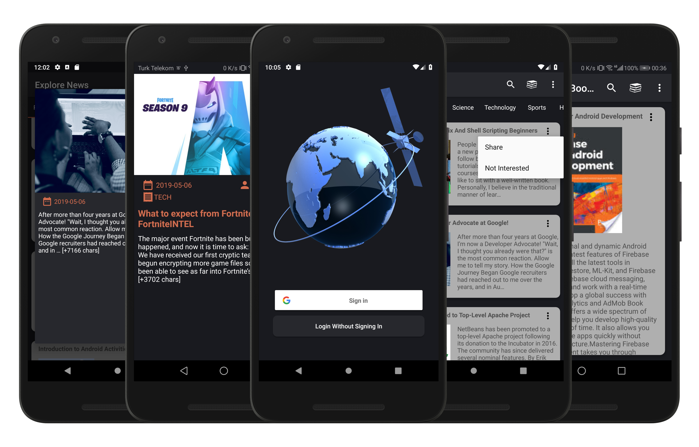

# NewsApplicationWithWeka
This repository contains News Application that builded around Weka Machine Learning Library and implements MVVM architecture using Room, Firebase, Glide, Retrofit, Butterknife and LeakCanary. 

## Introduction
Main purpose of the project is creating serverless recommendation system using Weka Machine Learning Library. To achieve this goal we stored seen news in application and used Naive-bayes classification algorithm for getting types of these news. After getting list of news types, we get top headlines from News api and created Clusters from them using K-Means Clustering Algorithm and put classified news into this algorithm and get clusters which these items are belong. After getting clusters of our items, we recommend other items in these clusters. 

## Getting Started
We are using Database and Authentication features of firebase. Before using repository you need to connect your firebase project to application.
###### Firebase Google Sign In Setup
- Go to the Firebase Console and navigate to your project:
- Select the Auth panel and then click the Sign In Method tab.
- Click Google and turn on the Enable switch, then click Save.
- Click edit icon and get Web client id and paste it to gradle.properties file using "firebaseClientKey" key.
###### Firebase Database
- Select the Database panel and then click the Rules Method tab.
```javascript
{
  "rules": {
    "users": {
      "$uid": {
        ".read": "$uid === auth.uid",
        ".write": "$uid === auth.uid"
      }
    }
  }
}
```
- Use above code as your rule.
###### News Api
- https://newsapi.org/docs api used for getting all news.
- Get your API-KEY and paste it to gradle.properties file using "newsApiKey" key.
## Result

